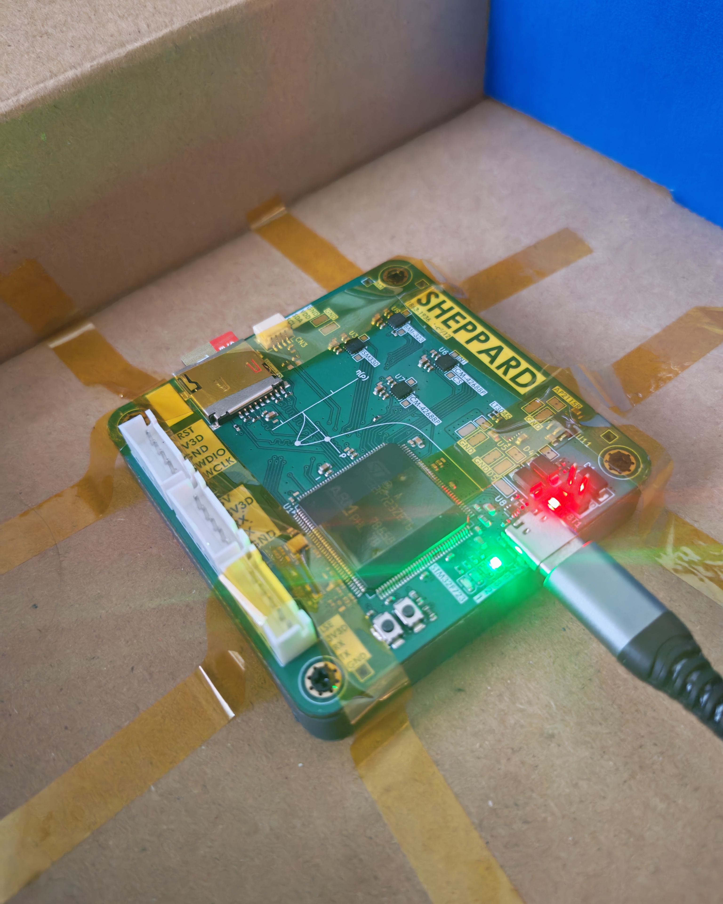

# Sheppard MEMS Rate-Register Quantisation Research Project

Custom STM32F723 hardware, firmware and analysis for measuring output-register
quantisation noise in MEMS rate gyroscopes. Specifically gyroscopes that report an
angular-rate register rather than an integrated angle increment.

[](https://doi.org/10.5281/zenodo.22860515)


*This is a pre-publication research project. The preprint is not yet released.
the results, figures and numbers in this repository are working values and are subject to change. 
Nothing here has been peer-reviewed. Preliminary Datasets are available on Zenodo*

---

## Claim

Rate-register quantisation is predicted to appear at a $-1/2$ Allan-deviation
slope and to be absorbed silently into the fitted angle random walk (ARW),
rather than appearing as the $-1$-slope angle-quantisation ("Q") term of IEEE
Std 952, which describes a different output architecture for angle-increment
parts (FOGs, RLGs). This holds regardless of the error's statistics: whether the
quantisation error is PQN-white, deadbanded, or dithered, it enters the rate
and therefore appears inside the fitted ARW instead of appearing as a separable Q.

If that is correct, fitted stochastic-noise parameters depend on the
configuration (output data rate (ODR), full-scale range (FSR), output word
length) at which they were measured, and the $\sqrt{\text{ODR}}$
bandwidth-transfer rule embedded in every mainstream IMU calibration toolchain,
where it is stated as a condition requiring ideal decimation rather than a
validated result, has never been checked for modern high-ODR consumer parts.

**Why this has gone unnoticed.** The transfer rule was safe for the parts it was
developed on. An MPU-6050-class gyro (≈5 mdps/√Hz, 2011) at ±2000 dps / 100 Hz
sits at a dither ratio $\rho = \sigma/\Delta \approx 0.58$, where the
pseudo-quantisation-noise (PQN) model is valid to ~2 %. The ICM-42688-P
(≈2.8 mdps/√Hz, 2020) sits at $\rho \approx 0.32$, where it is not.

The board is named after W. F. Sheppard, whose 1898 paper gave the $-c^2/12$
correction for the variance of grouped data
([DOI](https://doi.org/10.1112/plms/s1-29.1.353)) - the same $\Delta^2/12$ the
whole experiment turns on. The correction reappears in an unexpected place: the
20-bit reference stream is itself a quantiser, and Sheppard's correction must be
applied to it before it can serve as a reference at all.

---

## Project Goals

- Test whether the fitted stochastic-noise parameters of a MEMS IMU transfer
  across ODR and FSR, and return a single configuration-invariant parameter set
  that does.
- Establish that rate-register quantisation presents at the $-1/2$ slope and is
  absorbed into the fitted ARW, distinct from the IEEE-952 angle-quantisation
  term.
- Derive the exact, parameter-free output-quantisation behaviour, governed by
  two quantities: the dither ratio $\rho = \sigma/\Delta$ and the sub-LSB bias
  phase $\mu \bmod \Delta$. Both measurable from a static code histogram with
  no additional hardware.
- Identify which requantisation architecture the output register implements
  (undithered/PQN, truncation, RPDF- or TPDF-dithered) from output data alone,
  validated against bit-exact software-dithered controls.
- Show that no mainstream toolchain (Kalibr, `allan_variance_ros`, …) models
  output-register quantisation or exposes $\rho$ or $\mu$, and document the
  effect size against configuration so a practitioner can locate their own.
- Publish the hardware, firmware, analysis code and a raw-integer-code,
  temperature-logged dataset. A dataset that, on the searches conducted, does
  not currently exist, because public IMU datasets are distributed as calibrated
  floats and the calibration destroys the code lattice.

---

## Project progress

| Item | Status |
| --- | --- |
| Data-logger PCB (4× IMU) Bring up | ✅ Complete |
| Firmware | ✅ Complete |
| Analysis chain ($\sigma$, $\rho$, $\mu$, $\varphi$, $\eta$; Allan; GMWM) | ✅ Complete |
| Exact $\eta(\rho,\varphi)$ theory, closed form | ✅ Validated |
| Primary curve $\eta(\rho)$ | ✅ Measured over a decade of $\rho$ |
| Experimental results vs exact theory | ✅ 0.4 % of range, no free parameters, both specimens |
| Relevance evidence (toolchain guidance, default ODR/FSR) | 🚧 In progress |
| Manuscript | 🚧 Skeleton, not in this repository |
| Preprint | ⏳ Not yet released |

---

## Hardware

|           |                                                            |
| --------- | ---------------------------------------------------------- |
| MCU       | STM32F723ZET6, 32 MHz                                       |
| Sensors   | 2× ICM-42688-P, 1× ISM330DHCX, 1× BMI323, one SPI bus each |
| Storage   | microSD on SDMMC2, exFAT                                    |
| Host link | USB-C on OTG_HS, internal HS PHY                            |
| Power     | 4S NiMH or USB-C                                            |



---

## Repository structure

```
GMWM Software/                 STM32CubeIDE firmware project + host Python
  Core/                          application sources
  tools/                         console, analysis, figures
GMWM Electronics/              KiCad 10 — data-logger PCB
Array Electronics ICM42688P/   KiCad 10 — ICM-42688-P board
Array Software ICM42688P/      firmware for the ICM-42688-P board
Test Datasets/                 records (gitignored; archived to Zenodo)
zenodo/                        dataset deposit build system
```

---

## Running it

```
pip install pyserial numpy matplotlib
python "GMWM Software/tools/sheppard_console.py"
```

The console is a GUI with five tabs: a terminal, the SD-card browser, the
campaign-plan editor, an analysis runner, and a figure viewer that renders the
plots in-app. It finds the board by USB ID rather than COM port and reconnects
on its own when the board resets.

Everything it does is also available from the command line, and the panel prints
the exact command before it runs it, so a result in the GUI and a result in a
terminal are the same result.

```
python analyse.py summary "../../Test Datasets" -o "../../Test Datasets/summary.csv" --fast
python figures.py "../../Test Datasets/summary.csv" -o "../../Figures"
python offset_fit.py "../../Test Datasets" --glob "*ph_k*.sdat"
```

---

## Flashing without an ST-LINK

The board reflashes itself over the same USB-C cable that carries the console.

Run `sheppard_selftest.py` once before trusting the flasher. It feeds the board
bad data five ways and checks each one is refused with flash untouched. Nothing
in it can erase the board.

SWD recovery is always there:

```
STM32_Programmer_CLI -c port=SWD mode=UR -e all -w "Debug/GMWM STM32.elf" -v -rst
```

---

## Status

94 records, two specimens, three axes. The register's architecture is identified
(truncation, bit-exact); $\eta(\rho)$ is measured over a decade of $\rho$; and a
controlled phase sweep tracks the exact theory to **0.4 % of its range with no
free parameters — on both specimens independently**. Repeatability is measured
at $\sigma_\eta = 0.0065$, so the theory is good to about twice the noise floor
of the apparatus.

The manuscript is a skeleton and is not held in this repository. The bench
work the preprint needs is
done; what remains is desk work — the relevance evidence, the software-dither
sweep, and the writing.

---

## Preprint and data

The preprint is not yet released. A manuscript is in preparation and is
intended for submission to a measurement-science journal (IOP
*Measurement Science and Technology*); this section will carry the preprint DOI
when it is public.

Campaign data is archived to Zenodo and is not held in this repository:

> Rhodes, J. (2026). *Paired 16-bit and 19-bit output records from two
> ICM-42688-P MEMS gyroscopes across output-rate and sub-LSB bias-offset
> sweeps* [Data set]. Zenodo. <https://doi.org/10.5281/zenodo.22860515>

---

## Conventions

SI units. LaTeX for maths. Campaign data goes to Zenodo with a DOI, not into
this repository.

The gyroscope's high-resolution FIFO field is 20 bits wide, of which 19 are
significant at ±2000 °/s full scale — the field's least significant bit is
always zero. All resolutions in this repository and in the dataset are quoted
on the 19-bit convention, so the reference lattice step is $\Delta' = \Delta/8$
and the register word is `gyro19 >> 3`.

---

## Licence

MIT — see `LICENSE`. The dataset is licensed separately under CC-BY-4.0.
